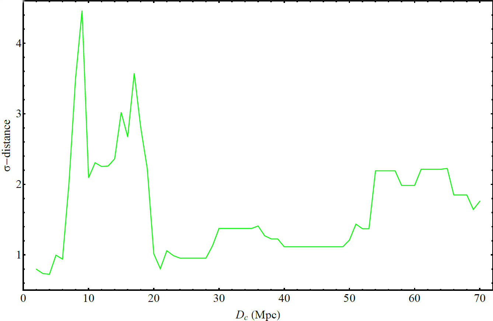

# Hints for a gravitational constant transition in Tully-Fisher data

This is the repository that contains the Mathematica code as well as useful comments that reproduce the figures of [arxiv:2103.04045](https://arxiv.org/abs/2103.04045).

## Abstract
We use an up to date compilation of Tully-Fisher data to search for transitions in the evolution of the Tully-Fisher relation. Using a recently published data compilation, we find hints at $\approx 3\sigma$ level for a transition at a critical distance $D_c \simeq 17 Mpc$. The zero point (intercept)  amplitude of the transition is $\Delta \log A_B \simeq 0.2 \pm 0.06$ while the slope remains practically unchanged. If the transition is interpreted as due to a gravitational strength transition, it would imply a shift of the effective gravitational constant to lower values for distances larger than $D_c\simeq 17 Mpc$ by $\frac{\Delta G}{G}=-0.1 \pm 0.03$. Such a shift is of the anticipated  sign and magnitude but at somewhat lower distance (redshift) than the gravitational transition recently proposed to address the Hubble and growth tensions ($\frac{\Delta G}{G}\simeq -0.1$ at transition redshift  $z_t\lesssim 0.01$ ($D_c\lesssim 40 Mpc$)).

## Citing the paper 
If you use any of the above codes or the figures in a published work please cite the following paper:
 *Hints for a gravitational constant transition in Tully-Fisher data*
 George Alestas, Ioannis Antoniou and Leandros Perivolaropoulos, [arxiv:2104.14481](https://arxiv.org/abs/2104.14481)

Any further questions/comments are welcome.

## Authors List
George Alestas - <g.alestas@uoi.gr>
 Ioannis Antoniou - <i.antoniou@uoi.gr>
 Leandros Perivolaropoulos - <leandros@uoi.gr>
